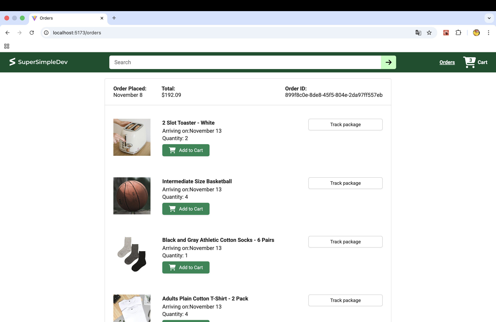
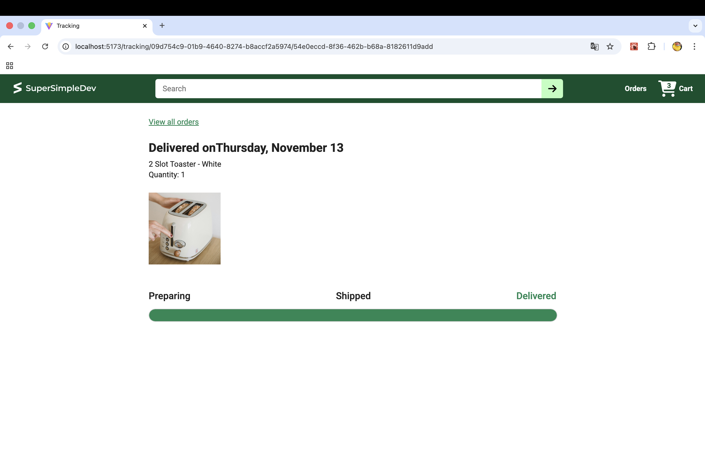
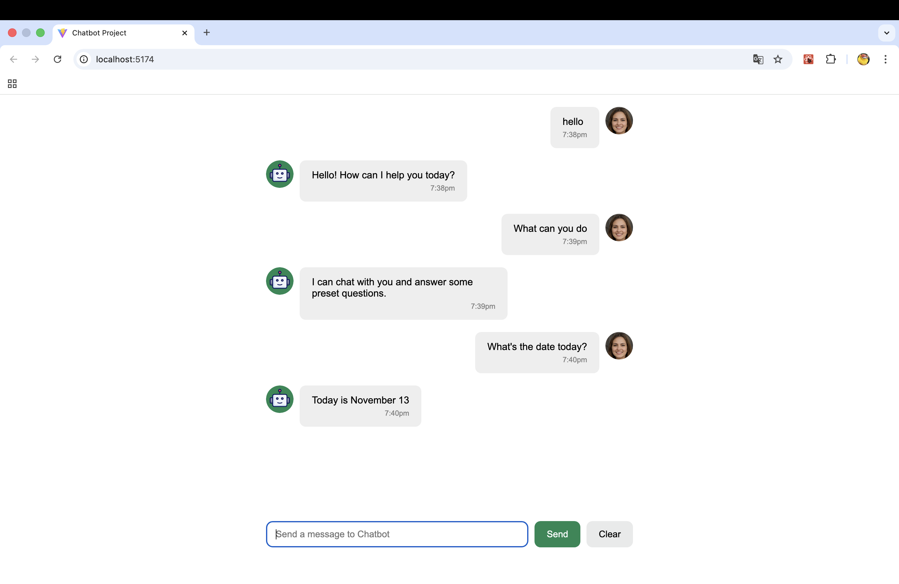

# 📦 React 学习项目合集

这个仓库包含我在学习 **React / TypeScript / Vite / Node.js 后端 / 全栈开发 / 测试** 过程中完成的多个项目。  
包括完整的电商网站前端、电商后端、聊天机器人项目，以及早期练习项目。

# 🌱 React Learning Archive (2025)

This repository contains all projects I built while learning React, TypeScript,
Vite, and basic backend development.  
It records my complete learning path from beginner → intermediate → full-stack.

---

## 📁 项目总览

### 1️⃣ ecommerce-project（电商前端）

使用 **React + TypeScript + Vite** 构建的完整电商网站前端，功能包括：

- 商品展示（列表、详情、评分、价格等）
- 购物车（添加、删除、更新数量、自动汇总）
- 结账流程（配送方式、配送时间、订单费用计算）
- 付款详情（税费、总价、运费）
- 订单历史（列表与详情）
- 订单跟踪（物流时间线 UI）
- 使用 Vitest + React Testing Library 编写测试

📂 路径：`./ecommerce-project`  
⭐ 本仓库中功能最完整的前端项目

---

### 2️⃣ ecommerce-backend（电商后端 API）

基于 **Node.js + Express + SQLite + Sequelize** 的后端服务，为电商前端提供 API。

包含：

- 商品 API  
- 配送选项 API  
- 购物车 API  
- 订单 API  
- 支付总结 API  
- 静态图片服务器  
- 默认数据库种子数据  

📂 路径：`./ecommerce-backend`

---

### 3️⃣ chatbot-project（聊天机器人 demo）

一个 React 小项目，用于练习：

- 输入框处理  
- 状态管理  
- 组件渲染  

📂 路径：`./chatbot-project`

---

### 4️⃣ old-projects（早期练习项目）

包含多个早期 React 练习项目，记录从入门到进阶的过程。

📂 路径：`./old-projects`

---
# 🖼️ 项目截图展示

以下是本仓库中部分项目页面截图：

## 🛍️ 电商项目（ecommerce-project）

### 首页（Home）


### 购物车 & 结账（Checkout）


### 订单列表（Orders）


### 订单追踪（Tracking）


---

## 🤖 聊天机器人项目（chatbot-project）


## 🚀 项目运行方式

### ▶️ 运行电商前端（ecommerce-project）

```sh
cd ecommerce-project
npm install
npm run dev
```

---

### ▶️ 运行电商后端（ecommerce-backend）

```sh
cd ecommerce-backend
npm install
npm run dev
```

---

### 🧪 运行测试（ecommerce-project）

```sh
cd ecommerce-project
npx vitest
```

---

## 🛠️ 技术栈（部分项目）

### 前端

- React 18  
- TypeScript  
- Vite  
- React Router  
- Axios  
- CSS Modules  
- Vitest + React Testing Library  

---

## 🙌 关于这个仓库

这个仓库代表了我从前端入门到全栈开发阶段的学习轨迹：

从最基础的 React 组件与状态管理，到完整的电商系统（前端 + 后端 + 测试 + TypeScript）。
