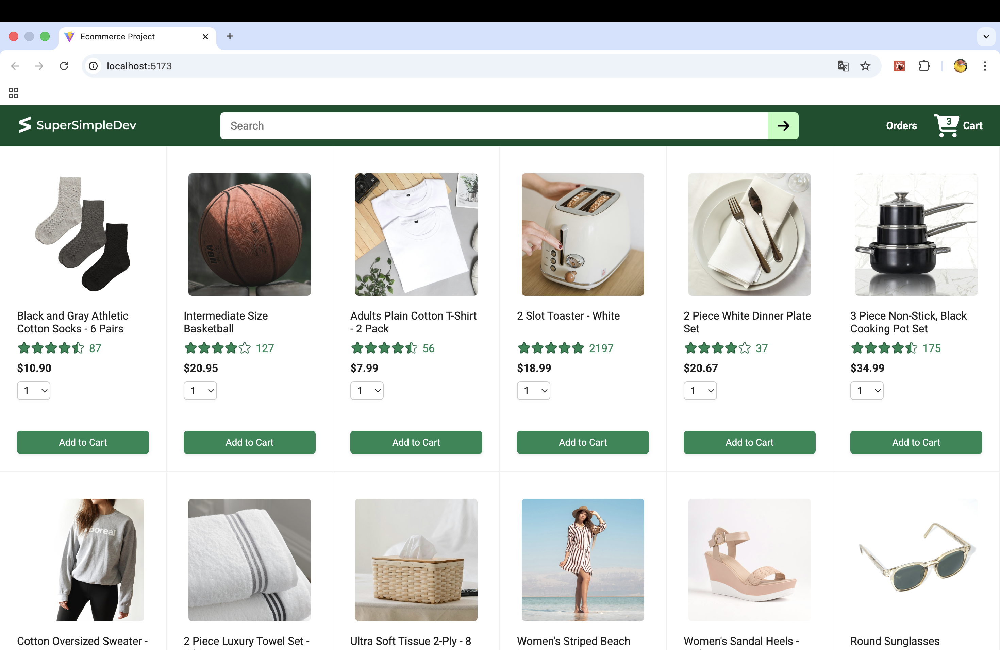
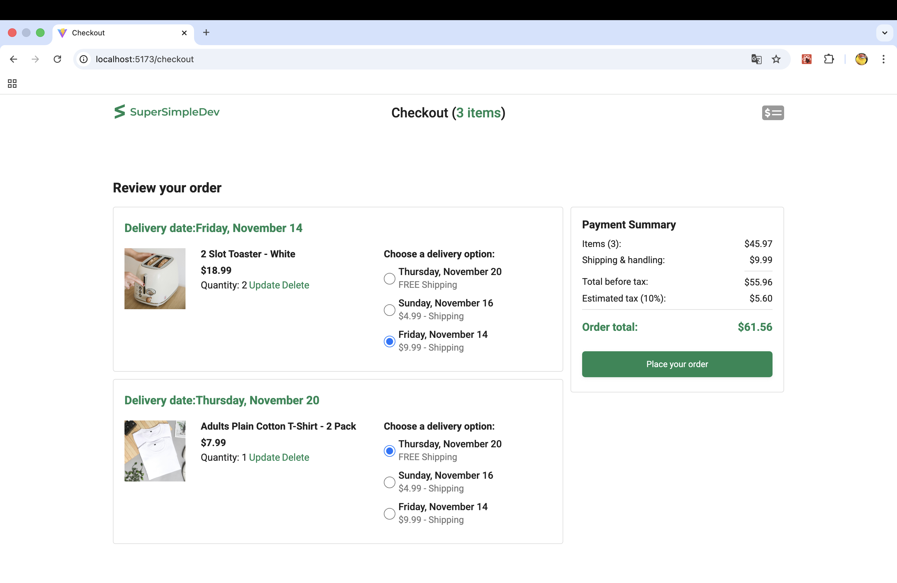

# 🛒 E-Commerce Project (React + TypeScript + Vite)

A fully-featured mock e-commerce frontend built with **React + TypeScript + Vite**,  
including product listing, cart, checkout flow, order history, order tracking, and tests.

---

## ✨ Features

### 🛍 Product
- Product grid view
- Product details
- Rating, price, keywords
- Data fetched from backend API

### 🛒 Shopping Cart
- Add to cart
- Update quantity
- Remove item
- Auto-recalculate subtotal

### 🚚 Delivery Options
- Select delivery option
- Estimated delivery date
- Recalculates cost dynamically

### 💰 Payment Summary
- Subtotal
- Delivery fee
- Tax (from backend)
- Total amount
- Fully reactive UI

### 🧾 Order Summary
- Order breakdown
- Delivery times
- Tracking status

### 📦 Order Tracking
- View single order
- View all items inside the order
- Delivery timeline

### 🧪 Testing Coverage
- Fully tested using Vitest + React Testing Library + user-event
- Tests for pages, components, and interactions

---

## 🛠️ Tech Stack

### Frontend
- React 18
- TypeScript
- Vite
- React Router
- Axios
- CSS Modules
- Vitest + React Testing Library

---
## 🖼️ Preview

### 🏠 Home Page


### 🛒 Checkout Page


### 📦 Orders Page


### 🚚 Tracking Page


---

## 📁 Project Structure & File Explanations

```markdown
ecommerce-project/
│
├── public/                         # Static assets served as-is
│
├── src/
│   ├── assets/                     # Images, icons, svg files
│   │
│   ├── components/                 # Reusable UI components
│   │   ├── Header.tsx              # Main header for navigation
│   │   ├── Header.css              # Header styles
│   │   └── Header.test.tsx         # Header unit tests
│   │
│   ├── pages/                      # All main application pages
│   │   ├── home/                   # Home page module
│   │   │   ├── HomePage.tsx        # Landing page with product list
│   │   │   ├── HomePage.test.tsx   # Tests for home page
│   │   │   ├── Product.tsx         # Individual product tile
│   │   │   ├── Product.test.tsx    # Product unit tests
│   │   │   ├── ProductsGrid.tsx    # Product grid layout
│   │   │   └── ProductsGrid.test.tsx
│   │   │
│   │   ├── checkout/               # Entire checkout flow
│   │   │   ├── CartItemDetails.tsx # Cart item component
│   │   │   ├── CheckoutHeader.tsx  # Checkout top navigation
│   │   │   ├── CheckoutPage.tsx    # Checkout main page
│   │   │   ├── CheckoutPage.css    # Checkout styles
│   │   │   ├── CheckoutPage.test.tsx
│   │   │   ├── DeliveryOptions.tsx # List of delivery options
│   │   │   ├── DeliveryOptions.test.tsx
│   │   │   ├── DeliveryData.tsx    # Delivery API + logic
│   │   │   ├── OrderSummary.tsx    # Summary (items + shipping)
│   │   │   ├── OrderSummary.test.tsx
│   │   │   ├── PaymentSummary.tsx  # Price, tax, total
│   │   │   └── PaymentSummary.test.tsx
│   │   │
│   │   ├── orders/                  # Order history + detail
│   │   │   ├── OrdersPage.tsx       # Orders list
│   │   │   ├── OrdersPage.css
│   │   │   ├── OrdersPage.test.tsx
│   │   │   ├── OrdersGrid.tsx       # Layout of multiple orders
│   │   │   ├── OrderHeader.tsx      # Order detail header
│   │   │   └── OrderDetailsGrid.tsx # Detailed order info
│   │   │
│   │   ├── tracking/                # Order tracking timeline
│   │   │   ├── TrackingPage.tsx     # Full tracking UI
│   │   │   └── TrackingPage.css
│   │   │
│   │   └── notfound/                # 404 fallback page
│   │       ├── NotFoundPage.tsx
│   │       └── NotFoundPage.css
│   │
│   ├── types/                       # Centralized TypeScript types
│   │   ├── product.d.ts
│   │   ├── cart.d.ts
│   │   ├── order.d.ts
│   │   └── user.d.ts
│   │
│   ├── utils/                       # Helper functions
│   │   ├── money.ts                 # Format money values
│   │   └── custom.d.ts              # Extra TS declarations
│   │
│   ├── App.tsx                      # Main app + routes
│   ├── App.css                      # Global app styles
│   ├── index.css                    # Base styles
│   ├── main.tsx                     # App entry point
│   └── vite-env.d.ts                # Vite TS helpers
│
├── package.json                     # Dependencies
├── tsconfig.json                    # TS config
├── setupTests.js                    # Vitest + RTL setup
└── README.md
```

---

## 🚀 Getting Started

### Install dependencies
```sh
npm install
```

### Run Development Server
```sh
npm run dev
```

### Build for Production
```sh
npm run build
```

---

## 🧪 Run Tests
```sh
npx vitest
```
